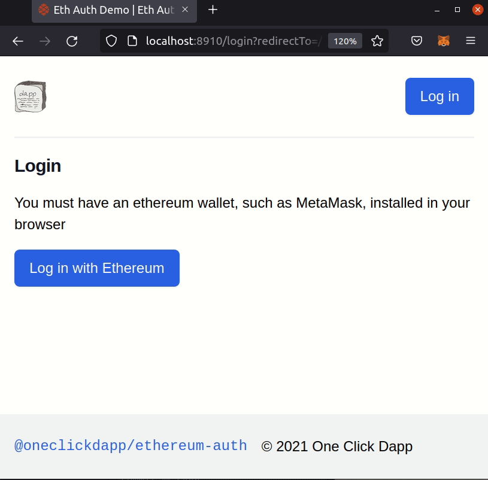

<h1 align="center">Welcome to @oneclickdapp/ethereum-auth 👋</h1>
<p>
    
  </a>
</p>

> Ethereum auth provider for RedwoodJS

Looking to implement your own custom Redwood Auth? You may this [tutorial](https://patrickgallagher.dev/blog/2020/12/27/tutorial-redwood-web3-login/tutorial-add-web3-login-to-redwoodjs) helpful.

### ✨ [Demo](https://redwood-ethereum-login-demo.vercel.app/)

Demo [source code](https://github.com/oneclickdapp/redwood-ethereum-login-demo)

<div align="center" >
 
</div>

## Quick Start

```js
const ethereum = new EthereumAuthClient({
  makeRequest,
  debug: process.NODE_ENV !== "development",
  infuraId: process.env.INFURA_ID
});

const { logIn, logOut, getCurrentUser, client } = useAuth();

// Trigger authentication
await logIn("walletConnect");
```

If this is your first time using Redwood Auth, you should check out the official Redwood [auth docs](https://redwoodjs.com/docs/authentication)

## Setup

If you haven't created a redwood app yet, you can do so now. See my [introductory blog post](https://patrickgallagher.dev/blog/2020/11/18/web3-redwood-intro/using-redwoodjs-to-create-an-ethereum-app) for more help getting started.

```bash
yarn create redwood-app myDapp
```

First let's do some scaffolding and install the necessary packages. This is where the 🧙‍♂️✨ magic happens!

```bash
cd myDapp
yarn rw setup auth ethereum
```

Next we need to update our models. Add `address` to the **User** model, and create a new `AuthDetail` model.

```js
// api/db/schema.prisma
model User {
  id         String     @id @default(uuid())
  address    String     @unique
  authDetail AuthDetail
}

model AuthDetail {
  id        String   @id @default(uuid())
  nonce     String
  timestamp DateTime @default(now())
}
```

Now lets use the generator for our new models. We only need the **sdl** for `AuthDetail`.

```bash
yarn rw generate scaffold user
yarn rw generate sdl AuthDetail
```

You can delete the service for `authDetails`, since it won't be used.

Awesomesauce. Let's spin up our database!

```bash
yarn rw db save
yarn rw db up
```

We're halfway there. Now let's create a new service to verify Ethereum signatures. We'll start by creating the **sdl** `ethereumAuth.js`.

```js
// api/src/graphql/ethereumAuth.js
export const schema = gql`
  type Mutation {
    authChallenge(input: AuthChallengeInput!): AuthChallengeResult
    authVerify(input: AuthVerifyInput!): AuthVerifyResult
  }

  input AuthChallengeInput {
    address: String!
  }

  type AuthChallengeResult {
    message: String!
  }

  input AuthVerifyInput {
    signature: String!
    address: String!
  }

  type AuthVerifyResult {
    token: String!
  }
`;
```

Next create a new service named `ethereumAuth`, and paste in this code.

```js
// api/src/services/ethereumAuth/ethereumAuth.js
import { AuthenticationError } from "@redwoodjs/api";

import { bufferToHex } from "ethereumjs-util";
import { recoverPersonalSignature } from "eth-sig-util";
import jwt from "jsonwebtoken";

import { db } from "src/lib/db";

const NONCE_MESSAGE =
  "Please prove you control this wallet by signing this random text: ";

const getNonceMessage = nonce => NONCE_MESSAGE + nonce;

export const authChallenge = async ({ input: { address: addressRaw } }) => {
  const nonce = Math.floor(Math.random() * 1000000).toString();
  const address = addressRaw.toLowerCase();
  await db.user.upsert({
    where: { address },
    update: {
      authDetail: {
        update: {
          nonce,
          timestamp: new Date()
        }
      }
    },
    create: {
      address,
      authDetail: {
        create: {
          nonce
        }
      }
    }
  });

  return { message: getNonceMessage(nonce) };
};

export const authVerify = async ({
  input: { signature, address: addressRaw }
}) => {
  try {
    const address = addressRaw.toLowerCase();
    const authDetails = await db.user
      .findOne({
        where: { address }
      })
      .authDetail();
    if (!authDetails) throw new Error("No authentication started");

    const { nonce, timestamp } = authDetails;
    const startTime = new Date(timestamp);
    if (new Date() - startTime > 5 * 60 * 1000)
      throw new Error(
        "The challenge must have been generated within the last 5 minutes"
      );
    const signerAddress = recoverPersonalSignature({
      data: bufferToHex(Buffer.from(getNonceMessage(nonce), "utf8")),
      sig: signature
    });
    if (address !== signerAddress.toLowerCase())
      throw new Error("invalid signature");

    const token = jwt.sign({ address }, process.env.ETHEREUM_JWT_SECRET, {
      expiresIn: "5h"
    });
    return { token };
  } catch (e) {
    throw new Error(e);
  }
};
```

Last step, we need to create a secret for issuing jwt tokens.

```bash
openssl rand -base64 48
```

Add the result as `ETHEREUM_JWT_SECRET` to your .env file.

Done! You can use your shiny new Ethereum auth. For a full example see https://github.com/oneclickdapp/redwood-ethereum-login-demo. In the meantime, here's a quick snippet to get you started.

```js
// web/src/pages/LoginPage/LoginPage.js
import { Link, routes, navigate } from "@redwoodjs/router";
import { useAuth } from "@redwoodjs/auth";
import { useParams } from "@redwoodjs/router";

const LoginPage = () => {
  const { logIn } = useAuth();
  const { redirectTo } = useParams();

  const onLogin = async () => {
    await logIn();
    navigate(redirectTo || routes.home());
  };

  return (
    <>
      <h1>LoginPage</h1>
      <p>
        You must have an ethereum wallet, such as MetaMask, installed in your
        browser
      </p>
      <button onClick={onLogin}>Log in with Ethereum</button>
    </>
  );
};

export default LoginPage;
```

## Wallet Connect

You must pass an optional `rpc` or `infuraId` to use Wallet Connect.

```js
ethereum = new EthereumAuthClient({
  makeRequest,
  // Note: you must set NODE_ENV manually when using Netlify
  debug: process.NODE_ENV !== "development",
  infuraId: process.env.INFURA_ID
  // For rpc see https://docs.walletconnect.org/quick-start/dapps/web3-provider#provider-options
});
```

Then pass the type "walletConnect" when you unlock

```js
const { logIn, logOut, getCurrentUser } = useAuth()

const onClickWalletConnect = async () => {
  await logIn("walletConnect")
```

## Additional Resources

Now that you've completed setup, you might find these resources useful. More docs/examples are welcome here!

- Tutorial II Role-based access control (RBAC) https://redwoodjs.com/tutorial2/role-based-authorization-control-rbac
- Cookbook RBAC https://redwoodjs.com/cookbook/role-based-access-control-rbac

## Contributing

### Basic

If you're only editing this package, then you just link `@oneclickdapp/ethereum-auth` in your test redwood app.

```bash
yarn link @oneclickdapp/ethereum-auth
```

### Advanced

If you're changes affect how internal stuff in RedwoodJS uses this package, then you'll need to do a bit more work. Things that may be affected include decoders in `@redwoodjs/api`, frontend tooling in `@redwoodjs/auth`, and CLI generators in `@redwoodjs/cli`. Unfortunately, `yarn link` will not work for redwood local development. Please follow the guide here https://github.com/redwoodjs/redwood/blob/main/CONTRIBUTING.md#local-development for more help.

```bash
# In the redwood repo
yarn build:watch

# Then in your example redwood app
yarn rwt copy:watch ../redwood
```

## TODO

- [x] Add support for `walletconnect`
- [ ] Allow direct access to the ethers `provider` on the client.
- [ ] Export typescript types here for the user object, instead of declaring them inside `@redwoodjs/auth`
- [ ] Add support for `walletlink`

## Publishing

```bash
yarn publish --dry-run
```

## Author

👤 **Patrick Gallagher <blockchainbuddha@gmail.com>**

- Website: https://patrickgallagher.dev
  - Twitter: [@pi0neerpat](https://twitter.com/pi0neerpat)
  - GitHub: [@pi0neerpat](https://github.com/pi0neerpat)

## Show your support

Give a ⭐️ if this project helped you!

---

_This README was generated with ❤️ by [readme-md-generator](https://github.com/kefranabg/readme-md-generator)_
